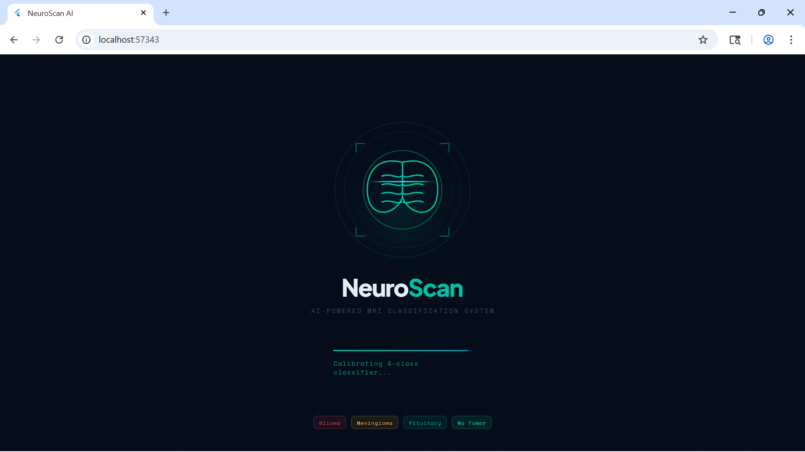
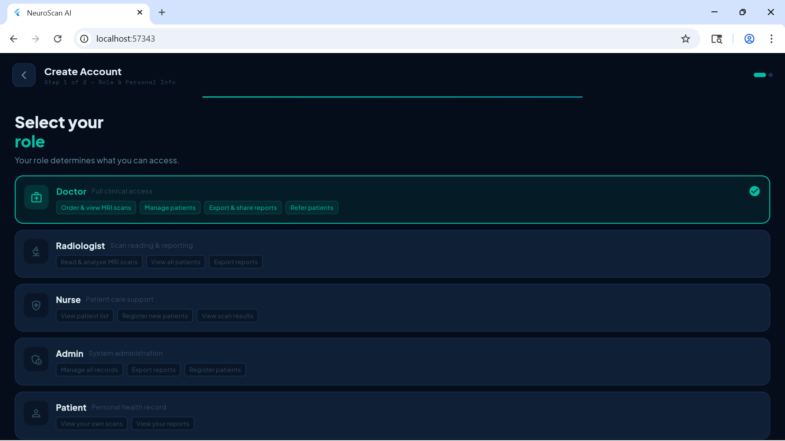
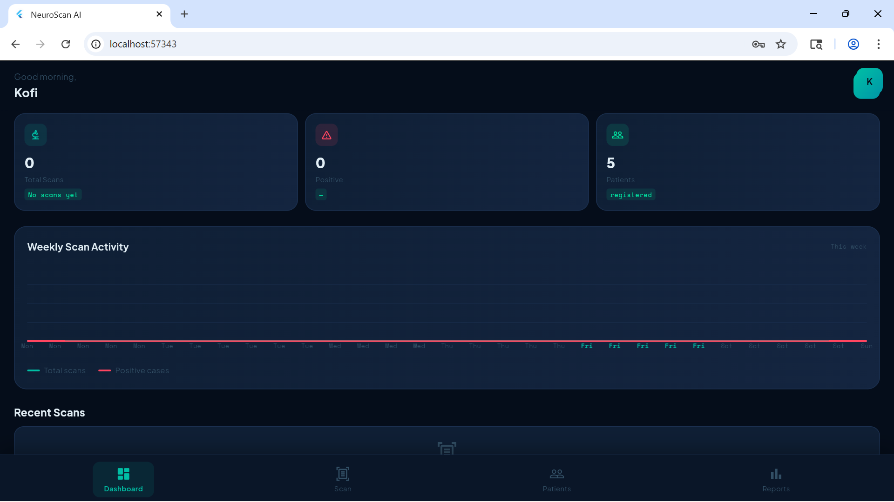
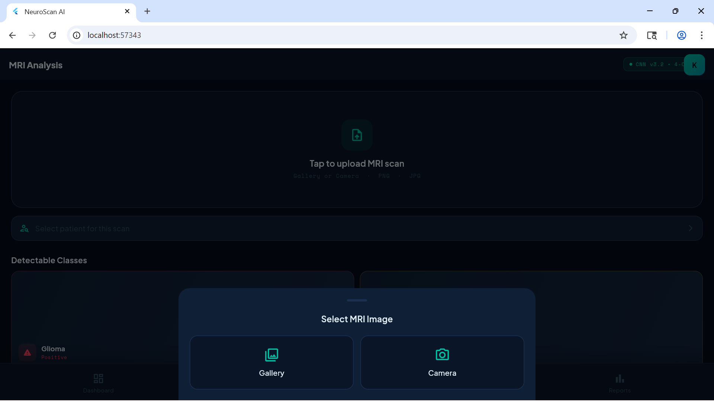
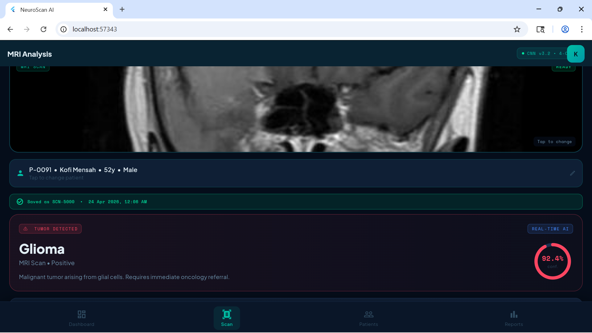
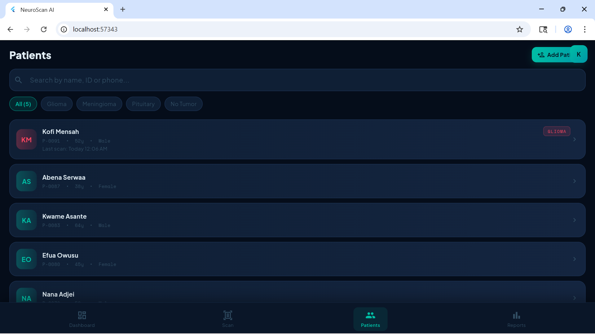
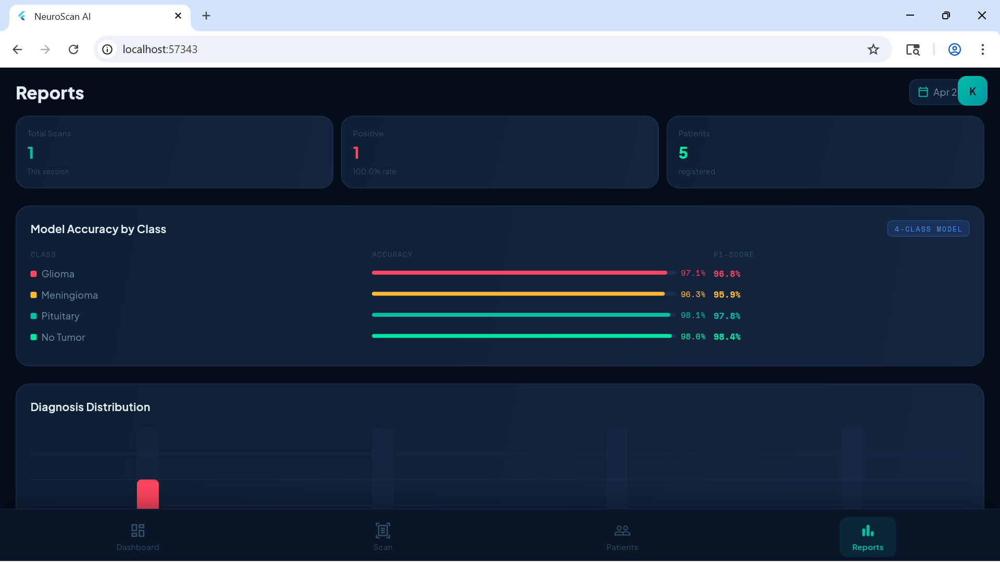

# NeuroScan

**A mobile-first brain tumor detection app that classifies MRI scans using a deep learning model deployed as a TensorFlow Lite classifier behind a FastAPI backend.**

NeuroScan pairs a Flutter mobile front-end with a Python FastAPI service. Users (clinicians or technicians) can capture or upload a brain MRI image and receive a tumor classification with a confidence score, all within a clean, session-based interface.

> **Disclaimer:** NeuroScan is a personal portfolio project built for educational purposes. It is not a medical device and must not be used for actual diagnosis or treatment decisions. Always consult a qualified radiologist or clinician.

---

## Screenshots

| Splash | Signup |
|--------|--------|
|  |  |

| Dashboard | Scan Upload |
|-----------|-------------|
|  |  |

| Scan Result | Patients |
|-------------|----------|
|  |  |

| Reports |
|---------|
|  |

---

## Features

- **MRI-based tumor classification** across four classes: **Glioma**, **Meningioma**, **Pituitary Tumor**, and **No Tumor**.
- **Cross-platform mobile app** built in Flutter, targeting Android, iOS, macOS, Linux, Windows, and Web.
- **REST API backend** built with FastAPI, serving the TFLite model via a Python inference pipeline.
- **User authentication** - signup, login, and session-based access control.
- **Patient management** - create patient records and link scans to patients over time.
- **Scan history and reports** - browse past scans and generate shareable reports.
- **Dockerized backend** - included Dockerfile for easy deployment.

---

## Model Performance

| Metric | Value |
|--------|------|
| Architecture | CNN with transfer learning (EfficientNet base) |
| Classes | Glioma, Meningioma, Pituitary, No Tumor |
| Training Accuracy | **91.73%** |
| Validation Accuracy | **94.63%** |
| Dataset | Brain Tumor MRI Dataset (Kaggle) |
| Deployment Format | TensorFlow Lite (.tflite) |

Training accuracy is lower than validation accuracy because of dropout and data augmentation applied during training - the validation score reflects real-world performance on unseen scans.

---

## Tech Stack

**Mobile (Frontend)**
- Flutter / Dart
- Multi-platform targets (Android, iOS, macOS, Linux, Windows, Web)
- HTTP client for REST API communication
- Custom theming (light/dark support)

**Backend**
- Python 3.11
- FastAPI (async REST API)
- Uvicorn (ASGI server)
- SQLAlchemy (ORM)
- Pydantic (schema validation)
- TensorFlow Lite runtime (model inference)
- Pillow / NumPy (image preprocessing)

**Machine Learning**
- CNN with transfer learning (EfficientNet)
- Trained on the Brain Tumor MRI Dataset (Kaggle)
- Exported to TFLite for efficient on-server inference

**DevOps**
- Docker (containerized backend)

---

## Getting Started

### Prerequisites
- Python 3.11 or later
- Flutter SDK 3.x
- Git
- A device, emulator, or Chrome browser

### 1. Clone the repository

    git clone https://github.com/kofi-takyi-agyeman/neuroscan.git
    cd neuroscan

### 2. Set up the backend

    cd backend
    python -m venv venv
    venv\Scripts\activate
    pip install -r requirements.txt

### 3. Run the backend

    uvicorn app.main:app --reload --host 0.0.0.0 --port 8000

The API will be available at http://localhost:8000 and interactive docs at http://localhost:8000/docs.

### 4. (Alternative) Run the backend with Docker

    cd backend
    docker build -t neuroscan-backend .
    docker run -p 8000:8000 neuroscan-backend

### 5. Run the Flutter app

    cd frontend/flutter_app
    flutter pub get
    flutter run -d chrome

Make sure the app can reach the backend URL. If running on a physical device, replace localhost in the API configuration with your machine's LAN IP.

---

## API Overview

| Endpoint | Method | Description |
|----------|--------|------------|
| /auth/signup | POST | Register a new user |
| /auth/login | POST | Authenticate a user |
| /predict | POST | Upload an MRI image and receive a tumor classification |
| /patients | GET/POST | List or create patient records |
| /patients/{id} | GET/PUT/DELETE | View, update, or delete a patient |

Interactive API docs are available at /docs once the backend is running (FastAPI Swagger UI).

---

## Roadmap

- [ ] Deploy backend to a cloud provider (Render / Fly.io)
- [ ] Add unit tests for the prediction endpoint
- [ ] Add Grad-CAM visualizations to explain model predictions
- [ ] Expand to tumor segmentation in addition to classification
- [ ] Improve data augmentation pipeline
- [ ] Add offline on-device inference (remove backend dependency for classification)

---

## Contributing

This is a personal portfolio project, but feedback and suggestions are welcome. Feel free to open an issue.

---

## License

This project is licensed under the MIT License - see the LICENSE file for details.

---

## Author

**Kofi Takyi Agyeman**
Mobile and Machine Learning Engineer, Accra, Ghana

- GitHub: [@kofi-takyi-agyeman](https://github.com/kofi-takyi-agyeman)
- Email: takyikelvin23@gmail.com